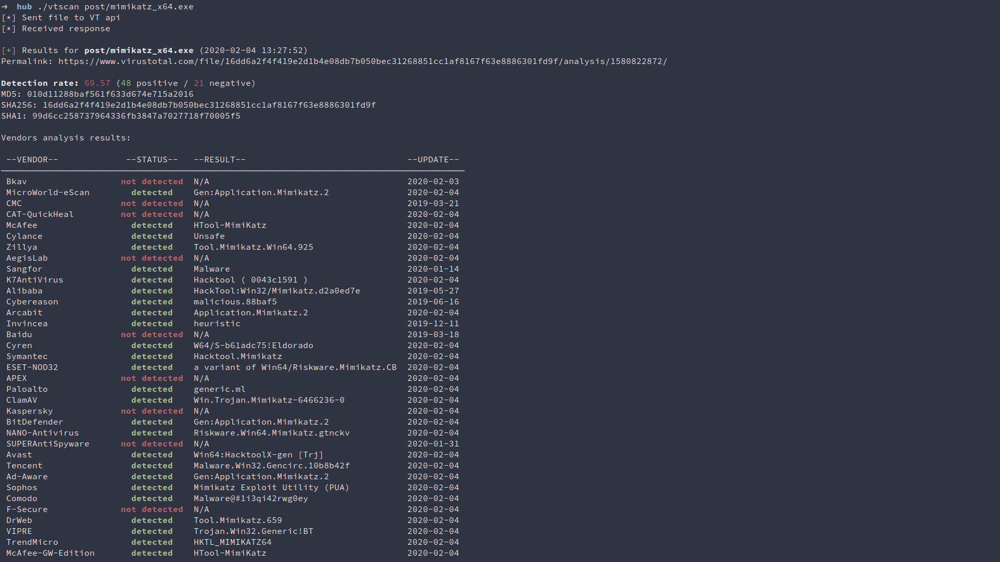

# VTSCAN

Scan a file directly from your terminal using VirusTotal API 

<p align="center">

</p>

## Usage
In order for this script to work, define your VirusTotal API key in the `api_key` variable inside it, or pass it using `-k <you_key_here>`

```
usage: vtscan.py [-h] [-k <api_key>] [-q] [-p] [-o] [-c] FILE

positional arguments:
  FILE                  File containing hashes, binary, hash string or
                        directory

optional arguments:
  -h, --help            show this help message and exit
  -k <api_key>, --key <api_key>
                        Specify VT API key
  -q, --quiet           Do not print vendor analysis results
  -p, --positive        Show only positive results in vendor analysis
  -o, --out             Save JSON response to a file
  -c, --clear           Clear screen before printing vendor analysis results
```
  
## License
This software is under [MIT License](https://en.wikipedia.org/wiki/MIT_License)
